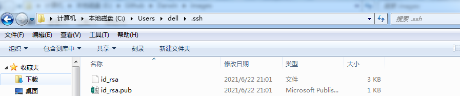

问题：如何使用github仓库保存自己的笔记

步骤：

1. 登录github.com并创建账户
2. 新建仓库


​	输入仓库名、描述及配置等

3. 下载git并进行环境配置

   这里我还不太清楚做的原因和必要性后续补充，先说步骤：

   * 下载git（cmd中验证安装成功）

   [git下载地址]: https://git-scm.com/download

   * 打开Git Bash并配置用户名及邮箱

   ```shell
   # 配置用户名
   git config --global user.name "username"    //（ "username"自己的账户名，）
   # 配置邮箱
   git config --global user.email "username@email.com"     //("username@email.com"注册账号时用的邮箱)
   ```

   * 生成ssh(连按三次回车，其中会告知id_rsa路径)

   ```shell
   ssh-keygen -t rsa
   ```

   * 前往github的settings中选择SSH and GPG keys

     打开刚才生成ssh的路径如下：

     

     打开并复制id_rsa的内容，在SSH keys中新建，标题随意，Key输入刚才复制的内容

   * 验证SSHkey是否添加成功

     打开Git Bash，输入：

     ```shell
     ssh -T git@github.com
     ```

     按下回车后，输入yes再次按下回车，出现如下提示，则添加成功。

     

   

   

   

